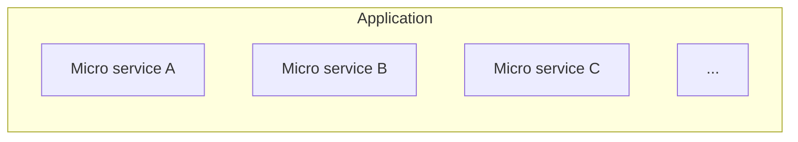

# MSA
MSA는 Micro Service Architecture의 약자이다.
Micro service는 아래 그림과 같이 특별한 비지니스 목표를 가지고 있는 단일 Application의 개별 구성 요소이다.

즉 MSA는 단일 Application을 작은 서비스(Micro service) 모음으로 개발하는 접근방식이며, 각각은 자체적인 프로세스에서 실행되고 HTTP 리소스 API와 같은 방식으로 통신한다.
MSA는 비지니스 기능을 중심으로 구축되어 있으며, 완전히 자동화된 배포환경에서 각각의 기능을 독립적으로 배포할 수 있다.

## 참고문헌
[Microservice](https://martinfowler.com/articles/microservices.html#CharacteristicsOfAMicroserviceArchitecture)   
[Microservices Guide](https://martinfowler.com/microservices/)   
[Microservice Architecture](https://www.techtarget.com/whatis/definition/microservice-architecture-MSA)