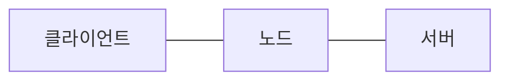

# http관련 항목
HTTP 기술을 사용하는 모든 개발자
* 모바일 앱
* 웹 프론트엔드
* 백엔드

## 강의 순서
1. 인터넷 네트워크 : 복잡한 인터넷 망에서 어떻게 흐르는지

   1. 프로토콜 계층 : 
   2. TCP 3way handshake
   3. DNS 사용
2. URI와 웹 브라우저 요청 흐름
   1. URI
   2. URL
   3. URN
   4. HTTP 메세지 전송
   5. 요청 패킷 전달
3. HTTP 특징
   1. 무상태-Stateless
   2. HTTP 메세지가 어떤식으로 생겼는지
   3. HTTP 메서드
   4. 무작적 API URI 설계
   5. HTTP 메서드 종류
      1. GET
      2. POST
      3. PUT
      4. DELETE
   6. HTTP 메서드 속성
      1. 안전
      2. 멱등
      3. 캐시가능
      4. 동적 데이터 조회
      5. HTML Form 데이터 전송
      6. HTTP API 데이터 전송
      7. HTTP API 설계 예시
      8. HTTP 상태 코드
         1. 200
         2. 300 리다이렉트
         3. 400 클라이언트 오류
         4. 500 서버 오류
4. HTTP 헤더
   1. 표현
   2. 협상 (콘텐츠 네고시에이션) 요청시에만 사용함
      1. 클라이언트가 선호하는 미디어 타입 전달
      2. 클라이언트가 선호하는 문자 인코딩
      3. 클라이언트가 선호하는 압축 인코딩
      4. 클라이언트가 선호하는 자연언어
      5. Accept-Language 복잡한 예시
      6. 분할 전송
      7. 쿠키
5. HTTP 캐시
   1. 브라우저 캐시들이 왜 필요한지
   2. 어떤 메커니즘으로 동작하는지
   3. 프록시 캐시 서버
   4. 캐시를 어떻게 무효화?할 수 있는지?

