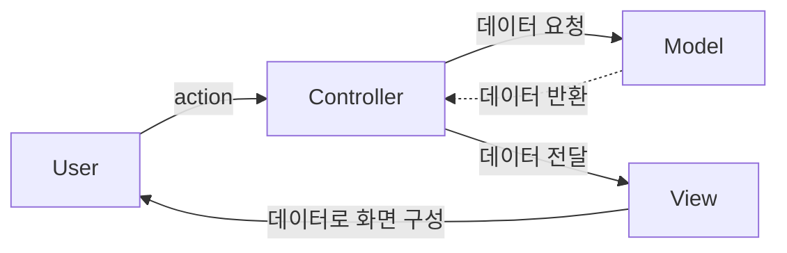
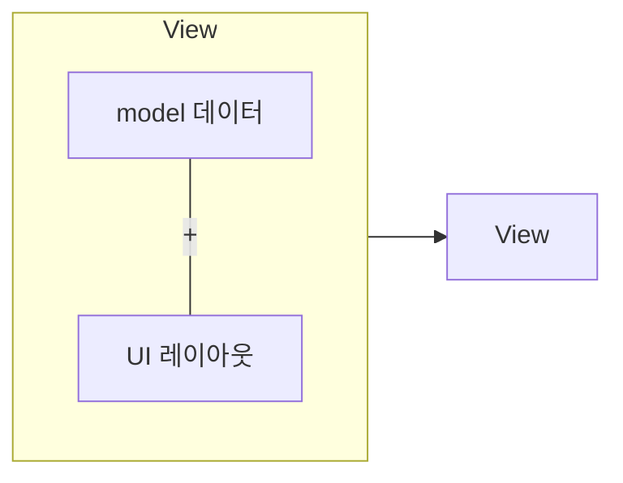

# MVC 패턴
## MVC 패턴 생성 이유
유지보수가 편해지는 코드 구성 방식

## 구성 요소
* Model : 어플리케이션에서 사용되는 데이터 부분 담당
* View : 사용자에게 보여지는 UI부분
* Controller : 사용자의 입력(Action)을 받고 처리하는 부분, Model과 View를 이어준다.

## MVC를 지키면서 코딩하는 방법
* 의존 == 관련된 코드 || import
1. Model은 Controller와 View에 의존하지 않아야 한다.
   * Model 내부에 Controller와 View에 관련된 코드가 있으면 안 된다.
2. View는 Model에만 의존해야 하고, Controller에 의존하면 안 된다.
3. View가 Model로부터 데이터를 받을 때는, 사용자마다 다르게 보여주어야 하는 데이터에 대해서만 받아야 한다.

4. Controller는 Model과 View에 의존해도 된다.
   * Controller 내부에는 Model과 View의 코드가 있을 수 있다.
5. View가 Model로부터 데이터를 받을 때, 반드시 Controller에서 받아야 한다.

## 참고자료
* [[디자인패턴] MVC, MVP, MVVM 비교](https://beomy.tistory.com/43)
* [[10분 테코톡] 🧀 제리의 MVC 패턴](https://www.youtube.com/watch?v=ogaXW6KPc8I)